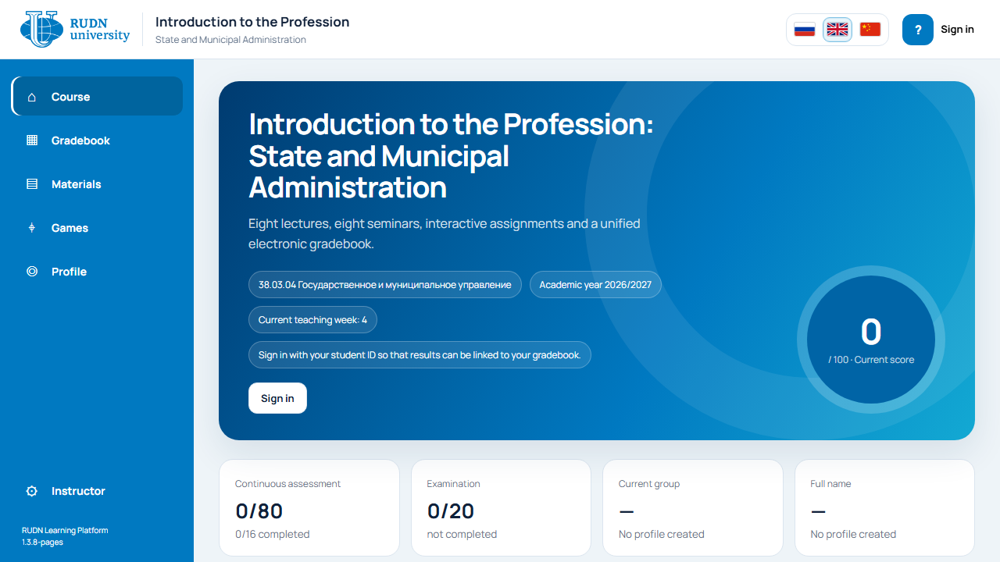
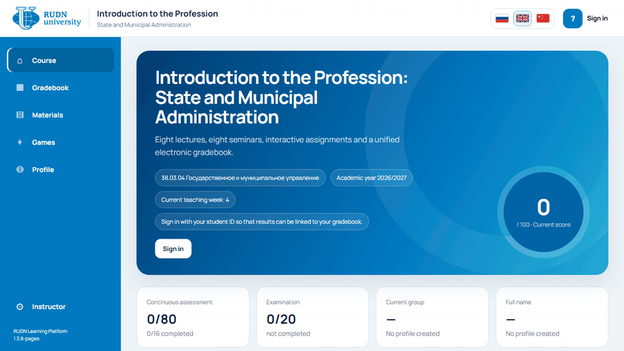
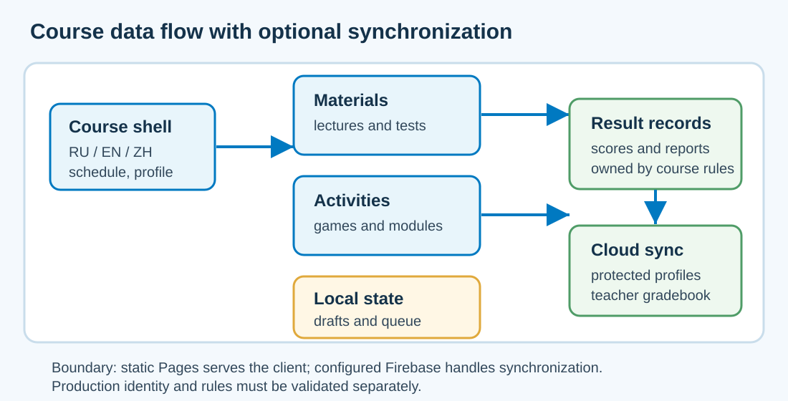
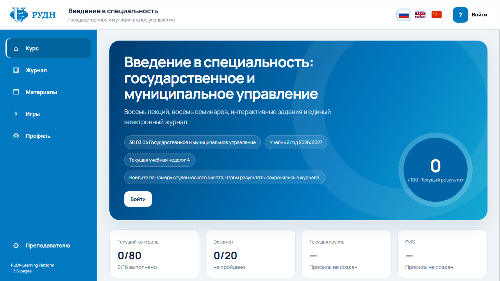
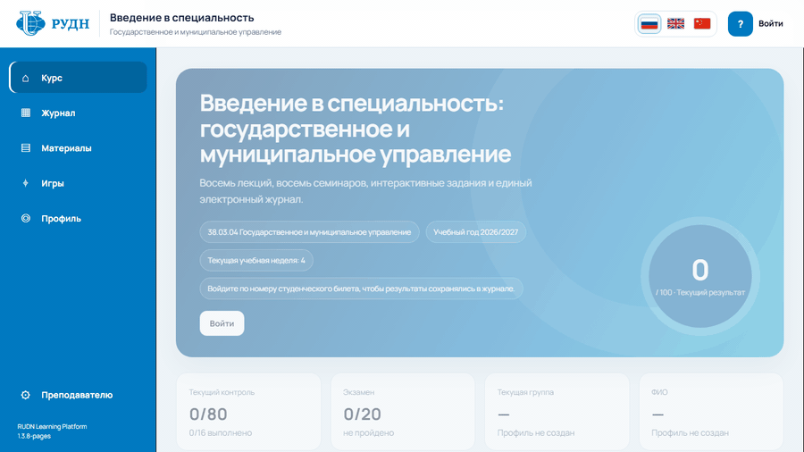
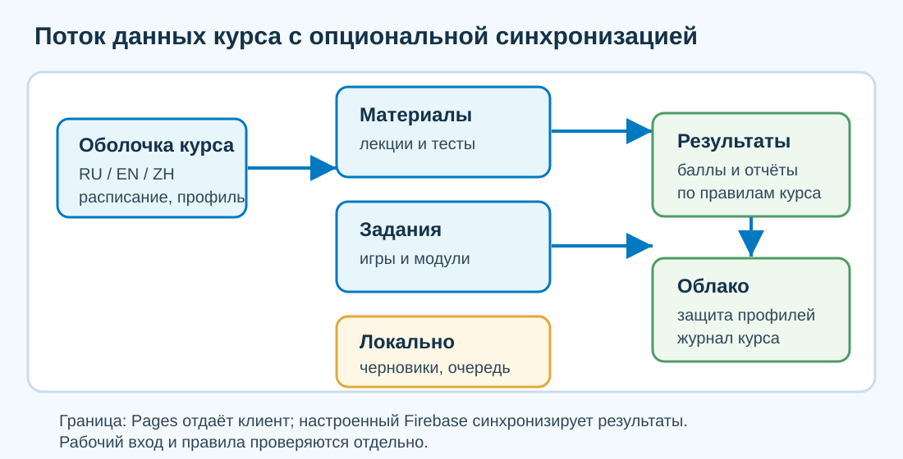

# RUDN Learning Platform

[English](#english) | [Русский](#русский)

Live site: [https://arseniy24rus.github.io/RUDN/](https://arseniy24rus.github.io/RUDN/)

<a id="english"></a>
## English





### Purpose

RUDN Learning Platform is a static GitHub Pages course environment for “Introduction to the Profession: State and Municipal Administration”. It is written for students who need a guided course path, and for an instructor who needs one place to publish materials, formative tests, practice games, and optionally synchronized results. The public site can be explored without signing in; the screenshots and demo GIF in this README use guest mode and do not create student records, gradebook rows, live sessions, production submissions, or Firebase writes.

### Workflow

A typical safe review scenario is: open the dashboard, inspect the visible course path, open Materials, then open Games and launch the geography puzzle in guest mode. That flow demonstrates the student experience without touching a production gradebook. For a configured class, the same shell can use Firebase Anonymous Authentication and Email/Password for profile state, local attempt queues, teacher access, gradebook synchronization, live quizzes, and uploaded confirmations. The platform deliberately distinguishes the educational profile key from strong identity proof; [`SECURITY.md`](SECURITY.md) explains that knowing another student identifier is not cryptographic authentication. [`DEPLOYMENT.md`](DEPLOYMENT.md) describes the static Pages deployment and Firebase rule deployment process.

### Data/methodology

The course surface is multilingual at the shell level: Russian, English, and Chinese navigation are available, while individual modules have their own coverage. The Governor simulator is documented as RU/EN in [`docs/GOVERNOR_NATIVE_INTEGRATION.md`](docs/GOVERNOR_NATIVE_INTEGRATION.md), and the career module describes its embedded locale contract in [`site/apps/career/README.md`](site/apps/career/README.md). The current course includes eight lectures and eight seminars, presentation and document materials, tests, a live quiz on branches and levels of power, a geography puzzle, a citizen-reception training module, a career-exploration module, and a Governor simulator with an automatic seminar-7 score formula. The geography puzzle covers world countries, ADM1 regions, all Russian federal subjects, and municipal maps for all 89 Russian subjects; its catalog and no-mistakes behavior are documented in [`docs/puzzle-quality.md`](docs/puzzle-quality.md) and [`docs/puzzle-no-mistakes.md`](docs/puzzle-no-mistakes.md).



### Architecture

Architecturally, this is a static site under [`site/`](site). The course shell is [`site/index.html`](site/index.html) plus JavaScript and CSS in [`site/assets`](site/assets). Firebase browser SDK files are built and pinned locally rather than pulled from a CDN at runtime. The native reception module is documented in [`site/apps/reception/README.md`](site/apps/reception/README.md), the career module in [`site/apps/career/README.md`](site/apps/career/README.md), and the Governor integration in [`docs/GOVERNOR_NATIVE_INTEGRATION.md`](docs/GOVERNOR_NATIVE_INTEGRATION.md). The shared service worker owns offline caching for the course and embedded modules; module-specific workers are avoided where the integration docs say so.

### Limits

The main limitation is the same one stated in the old README: GitHub Pages publishes client-side code and learning banks as static files. This is suitable for guided learning and formative assessment, but it is not a secure exam system without a trusted server-side assessment path. Local tests and guest screenshots also do not prove real production Firebase sign-in, rule deployment, or cloud delivery of a new grade. The repository contains third-party and module-specific licenses, including [`site/assets/vendor/xlsx/LICENSE`](site/assets/vendor/xlsx/LICENSE) and [`site/apps/governor/LICENSE`](site/apps/governor/LICENSE). Course text, authored assignments, RUDN branding, generated bundles, and third-party libraries should be reused only under their respective rights; this README does not add a new blanket open-source license.

### Local usage

The project uses Node.js 20+ for the documented checks. A minimal local preview is:

```bash
npm ci --ignore-scripts
npm run build:firebase
npm run build:career
python -m http.server 8765 --bind 127.0.0.1 --directory site
```

Then open `http://127.0.0.1:8765/`. Focused checks preserved from the repository include:

<details>
<summary>Focused checks and publication workflow</summary>

```bash
node --test scripts/test_governor_contract.mjs
node --test scripts/test_governor_service_worker.mjs
node --check site/assets/js/main.js
node --check site/assets/js/teacher-journal.js
node --check site/apps/governor/platform-bridge.js
node --check site/apps/governor/platform-contract.js
git diff --check
```

For the Governor browser workflow, the repository documents:

```bash
python scripts/test_governor_browser.py --output /tmp/rudn-governor-browser-qa
```

Keep browser-output directories outside the repository. The full Pages workflow is [`/.github/workflows/deploy-pages.yml`](.github/workflows/deploy-pages.yml); it builds Firebase and career assets, validates the static bundle, runs Governor, reception, durable-store, localization, and browser checks, then publishes `site/` through GitHub Pages.

</details>

<details>
<summary>Preserved publication notes</summary>

- On Windows, `publish_to_github.bat` and `publish_to_github.ps1` remain the convenience publication scripts.
- GitHub Pages should be configured for GitHub Actions.
- Firebase rules are in [`firebase/`](firebase); deploy only to the intended project after backup and review.
- A full browser check with real Firebase credentials is a separate operational step, not implied by local emulated or guest-mode tests.
- Clearing all browser site data removes local drafts and unsent work.

</details>

<a id="русский"></a>
## Русский





### Назначение

RUDN Learning Platform — статическая GitHub Pages-платформа курса «Введение в специальность: государственное и муниципальное управление». Она предназначена для студентов, которым нужен понятный маршрут по темам, и для преподавателя, которому нужен единый контур публикации материалов, формирующих тестов, интерактивных заданий и, при настройке Firebase, синхронизации результатов. Публичный сайт можно просматривать без входа; снимки и GIF в этом README выполнены в гостевом режиме и не создают студенческие записи, строки журнала, live-сессии, производственные отправки или записи Firebase.

### Рабочий сценарий

Безопасный сценарий ревью выглядит так: открыть главную панель, посмотреть учебный маршрут, перейти в «Материалы», затем открыть «Игры» и запустить географический пазл без входа. Такой маршрут показывает реальный интерфейс студента, но не трогает действующий журнал. В настроенном учебном запуске та же оболочка может использовать Firebase Anonymous Authentication и Email/Password для профиля, локальной очереди попыток, преподавательского доступа, синхронизации журнала, live-квизов и загрузки подтверждений. При этом платформа прямо разделяет учебный ключ профиля и строгую идентификацию личности: [`SECURITY.md`](SECURITY.md) поясняет, почему знание чужого номера не является криптографической аутентификацией. Развёртывание Pages и правил Firebase описано в [`DEPLOYMENT.md`](DEPLOYMENT.md).

### Данные и методология

Оболочка курса поддерживает русскую, английскую и китайскую навигацию, а отдельные модули имеют собственное покрытие языков. Интеграция симулятора губернатора описывает RU/EN-поддержку в [`docs/GOVERNOR_NATIVE_INTEGRATION.md`](docs/GOVERNOR_NATIVE_INTEGRATION.md), а карьерный модуль описывает контракт локализации в [`site/apps/career/README.md`](site/apps/career/README.md). В курсе есть восемь лекций и восемь семинаров, презентации и документы, тесты, live-квиз по ветвям и уровням власти, географический пазл, тренажёр работы с обращениями граждан, профориентационный модуль и нативный симулятор губернатора с автоматической формулой оценки за семинар 7. Географический пазл включает страны мира, ADM1-регионы зарубежных государств, 89 субъектов РФ и муниципальные карты всех 89 субъектов; качество каталога и отказ от счётчика ошибок описаны в [`docs/puzzle-quality.md`](docs/puzzle-quality.md) и [`docs/puzzle-no-mistakes.md`](docs/puzzle-no-mistakes.md).



### Архитектура

Технически проект — статический сайт в [`site/`](site). Оболочка курса состоит из [`site/index.html`](site/index.html), JavaScript и CSS в [`site/assets`](site/assets). Firebase SDK собирается и закрепляется локально, а не подгружается с CDN во время работы. Нативная «Приёмная» описана в [`site/apps/reception/README.md`](site/apps/reception/README.md), карьерный модуль — в [`site/apps/career/README.md`](site/apps/career/README.md), интеграция губернатора — в [`docs/GOVERNOR_NATIVE_INTEGRATION.md`](docs/GOVERNOR_NATIVE_INTEGRATION.md). Общий service worker управляет автономным кэшем курса и встроенных модулей; отдельные workers модулей не регистрируются там, где это запрещено интеграционным контрактом.

### Ограничения

Главное ограничение осталось прежним: GitHub Pages публикует клиентский код и учебные банки как статические файлы. Это подходит для учебного маршрута и формирующего оценивания, но не является защищённой экзаменационной системой без доверенного серверного контура. Локальные тесты и гостевые снимки также не доказывают реальный вход в производственный Firebase, публикацию правил или доставку новой оценки в облако. В репозитории есть сторонние и модульные лицензии, включая [`site/assets/vendor/xlsx/LICENSE`](site/assets/vendor/xlsx/LICENSE) и [`site/apps/governor/LICENSE`](site/apps/governor/LICENSE). Тексты курса, авторские задания, бренд РУДН, собранные bundles и сторонние библиотеки следует использовать только в рамках соответствующих прав; этот README не добавляет новую общую open-source-лицензию.

### Локальный запуск

Для локальных проверок нужен Node.js 20+. Минимальный просмотр:

```bash
npm ci --ignore-scripts
npm run build:firebase
npm run build:career
python -m http.server 8765 --bind 127.0.0.1 --directory site
```

Затем откройте `http://127.0.0.1:8765/`. Сохранённые фокусные проверки:

<details>
<summary>Фокусные проверки и workflow публикации</summary>

```bash
node --test scripts/test_governor_contract.mjs
node --test scripts/test_governor_service_worker.mjs
node --check site/assets/js/main.js
node --check site/assets/js/teacher-journal.js
node --check site/apps/governor/platform-bridge.js
node --check site/apps/governor/platform-contract.js
git diff --check
```

Для браузерной проверки губернатора в репозитории указан сценарий:

```bash
python scripts/test_governor_browser.py --output /tmp/rudn-governor-browser-qa
```

Вывод браузерных проверок следует держать вне репозитория. Полный workflow публикации — [`/.github/workflows/deploy-pages.yml`](.github/workflows/deploy-pages.yml): он собирает Firebase и career assets, валидирует статический каталог, запускает проверки губернатора, приёмной, durable-store, локализации и браузерных сценариев, затем публикует `site/` через GitHub Pages.

</details>

<details>
<summary>Сохранённые заметки по публикации</summary>

- В Windows остаются удобные сценарии `publish_to_github.bat` и `publish_to_github.ps1`.
- GitHub Pages нужно настроить на GitHub Actions.
- Правила Firebase лежат в [`firebase/`](firebase); разворачивайте их только в целевой проект после резервной копии и ревью.
- Полная проверка с реальными учётными данными Firebase — отдельный эксплуатационный шаг, а не следствие локальных гостевых тестов.
- Полная очистка данных сайта в браузере удаляет локальные черновики и неотправленные работы.

</details>
